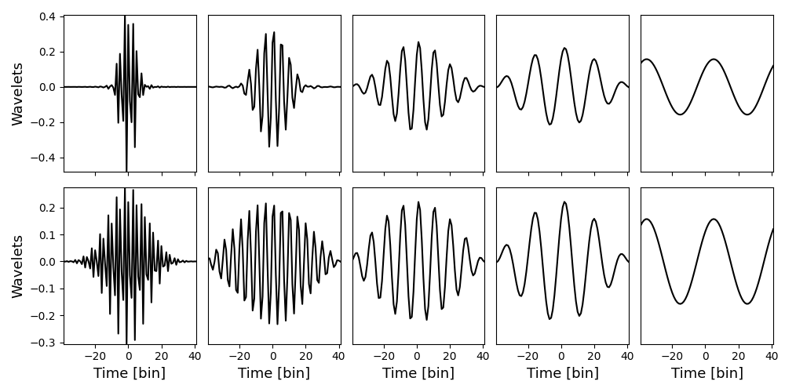

# learnable_wavelets

This module provides the `learnable_wavelet` class which builds a wavelet basis set from a learnable mother wavelet.
In doing so, the only learnable parameters are the Fourier components of the mother wavelet.
All the daughter wavelets are derived from the mother and do not introduce any further learnable parameters.
The $i^\text{th}$ daughter is defined as
$$D_i(t) = M\left(\frac{t}{2^i}\right)$$
where $M(t)$ is the learned mother wavelet.
With this structure, one is able to expand the expressiveness of their basis set without adding more learnable parameters.
This is because one is provided with N bases but only one (the mother) must be learned.

Learnable wavelets applied to a temporal signal are analogous to a learned filter/kernel in a convolutional neural network (CNN).
In a CNN a small (localized) filter is learned and then convolved with the image where regions of higher similarity produce a larger overlap value.
Similarly, wavelets are localized in both time and in their Fourier components.
These learned filters are then convolved in time with the temporal signal.
Wavelets can therefore find localized changes in a temporal signal, similar to how a CNN filter that is shaped like a corner can highlight corners in an image.
Consequently, wavelets can find the initial onset (t=0) of a temporal signal, which is often difficult in a Fourier transform as the Fourier basis is not localized in time.

## Example
Here I provide an example of what this package may produce.
We create two wavelet bases where the mother is defined as a Gaussian, the widths of these Gaussians are different for each of the two bases.
The mother wavelet (left) is the fastest varying temporal signal, while its daughters oscillate slower.

*__Figure 1:__ I show two wavelet bases (top and bottom rows). The mother wavelet for each basis is in the left column. The daughters are more slowly varying and are derived from the mother according to the above equation. This was generated by `tests/plotting_wavelets_spectrums.py`.*\
\
Now that we have seen an example of what wavelets can look like in real space (time), we must examine them in Fourier space since that is where they are defined.
In Fourier space (Fig. 2), the mother wavelet (black) is the broadest while the daughter spectrums are calculated by shifting the mother spectrum lower and sharpening it.

*__Figure 2:__ I show two Fourier coefficients of the wavelet bases (left and right) shown in Fig. 1. The left image corresponds to the bases in the top row of Fig. 1, while the right image corresponds to the bottom row in Fig. 1. The real components are denoted by solid lines and the imaginary components are the dashed lines. The mother wavelet for each basis is in colored black and the subsequent daughters are in different colors. Here the right-most distributions correspond to the left columns in Fig.1 and as one traverses left here, one traverses right in columns for Fig. 1. This was generated by `tests/plotting_wavelets_spectrums.py`.*\
\
Therefore, the mother wavelet has more non-zero Fourier components than the daughters.
This is important because we will be learning the mother Fourier coefficients and it is easier to downsample in order to compute the daughters, rather than upsampling and interpolating.

Now that we have two wavelet bases we would like to convolve them over a time-dependent signal to see what the output would look like.
To do this we will convolve our bases in Fig. 1 with themselves, so our time-dependent signal is the bases.
From Fig. 2, for each basis set we see that each daughter and the mother do not overlap in Fourier space.
This indicates that each wavelet within a basis set should be orthogonal.
However, each mother and daughter between the two basis sets overlap and we would expect them to not be orthogonal.
When convolving the basis sets with themselves (Fig. 3 and 4) this is exactly what we observe.

*__Figure 3:__ I show the projection of the mother wavelet (shown here in the top row) from the top/left basis set in Figs. 1/2 on all the bases in Figs. 1 and 2. The projection coefficients as a function of convolving this mother basis in time are shown in the lower plot. This was generated by `tests/signal_projection.py`.*\
\

*__Figure 4:__ I show the projection of the mother wavelet (shown here in the top row) from the bottom/right basis set in Figs. 1/2 on all the bases in Figs. 1 and 2. The projection coefficients as a function of convolving this mother basis in time are shown in the lower plot. This was generated by `tests/signal_projection.py`.*\
\
In Fig. 3 we observe that the basis is orthogonal to all other bases except itself and the other mother.
The convolution with itself is more peaked since the other mother is more broad.
Similarly in Fig. 4, we observe the same behavior except that both projection distributions have similar widths.
This is because the basis we are convolving with is already broad.
We also observe that the convolution with itself yields larger coefficients, this is because the other mother is more peaked and therefore does not overlap with all the components of this basis.

To generate these plots and get an idea of how to create these wavelets and convolve them with a time-dependent signal, I encourage you to take a look at `tests/plotting_wavelets_spectrums.py` and `tests/signal_projection.py`.
They can be run by `python3 run_tests.py --name plotting_wavelets_spectrums` and `python3 run_tests.py --name signal_projection` from the top directory, respectively.
